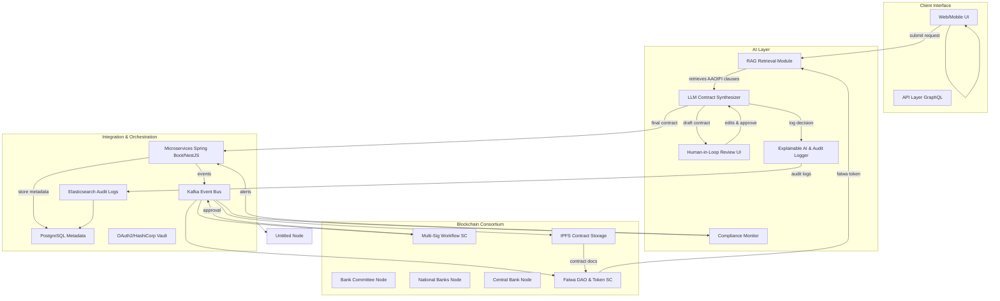
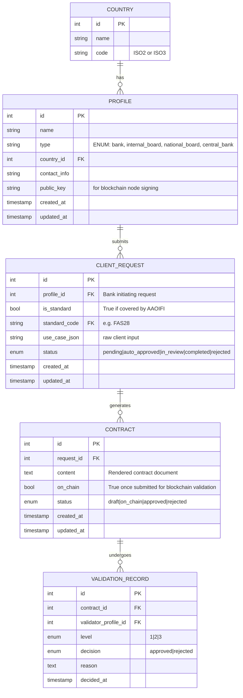

# Al-Burāq: Next-Generation Shariah Compliance Platform

> “Verily, Allah commands you to render trusts to whom they are due.” (Quran 4:58)
> In a world driven by profit, Al-Burāq ensures your financial products honor the sacred trust of Shariah compliance—swiftly, transparently, and collaboratively.

---

<br>

## Problem
In contrast to conventional banks—where virtually any client request can be processed immediately—Islamic banks must ensure that every transaction is structured around a Shariah-compliant product rather than simply lending money. The real question, then, is whether every product or client request in Islamic finance is actually designed from the ground up to meet Shariah requirements.

The single **BIGGEST** challenge facing Islamic banks compared to their conventional counterparts is the complex, never-ending process of **developing**, **vetting**, and **validating** **NEW** products, contracts, and financial practices so that they remain fully AAOIFI-compliant in real time.

<br>

## ▶️ Introduction

**Al-Burāq** is an AI-and-blockchain-powered platform designed to **streamline** and **accelerate** the validation of Islamic finance products under AAOIFI standards. What once took months of paperwork and layered approvals now completes in **minutes**, without sacrificing rigor or transparency. By combining advanced AI drafting, human-smart review, and a permissioned blockchain governance layer, Al-Burāq empowers Islamic banks to innovate confidently, serving clients with faith-aligned offerings faster than ever.

---

<br>

## 🌟 Key Benefits

### 1. Lightning-Fast Approval

* **Before**: Weeks of document preparation, board meetings, and regulator filings.
* **Now**: End-to-end workflow—from product concept to final sign-off—in **under an hour**.

### 2. Rock-Solid Shariah Assurance

* **Automated AAOIFI Alignment**: AI retrieves and embeds the exact clauses, calculations, and risk metrics required by AAOIFI standards.
* **Scholarly Oversight**: Human-in-the-loop review ensures every contract gains scholar endorsement before going live.

### 3. Immutable Transparency

* **On-Chain Audit Trails**: Every draft, edit, vote, and rule update stores immutably on Hyperledger Fabric—auditable by compliance teams and regulators.
* **Explainable AI Logs**: Detailed rationales accompany every AI decision, so you always see **why** a clause was added or modified.

### 4. Collaborative Governance

* **2-of-3 Multisig Voting**: Internal Shariah board, National Shariah board, and Central Bank nodes must endorse any new product—no single point of approval.
* **Fatwa Token DAO**: A lightweight on-chain DAO where scholars issue and vote on “fatwa tokens” to update rules—once quorum is reached, all nodes refresh automatically.

### 5. Country-Wide Dissemination

* Approved contracts trigger automatic notifications to **all** Islamic banks in the client’s country, fostering rapid adoption and standardized offerings.

---

<br>


## 🔄 Financial Workflow (Traditional vs Al-Burāq)

| Step                                | Traditional Process                                                                 | Al-Burāq Process                                                                            |
| ----------------------------------- | ----------------------------------------------------------------------------------- | ------------------------------------------------------------------------------------------- |
| 1. Product Design & Internal Review | Create concept note, risk analysis, draft contracts; convene internal board (weeks) | Enter concept in UI; AI drafts contracts; scholars review inline (minutes)                  |
| 2. National Shariah Certification   | Compile dossier; submit to National Board; await fatwa (months)                     | Smart-contract submit: ballot pops up on blockchain nodes; 2-of-3 sign within minutes       |
| 3. Regulatory Authorization         | Submit certified documents to Central Bank; follow-up cycles                        | Central Bank node auto-receives on-chain record; signs digitally—no manual paperwork        |
| 4. Roll-Out & Adoption              | Train staff; integrate systems; market product                                      | One-click publish: all banks in country receive event, view contract, and onboard instantly |

---

<br>

## ⚙️ Technical Workflow & Architecture



---

<br>

## 🗄️ Database Schema Overview

* **Country**: id, name, ISO code
* **Profile**: banking or board entities (type, country, contact, public key, password hash)
* **ClientRequest**: incoming use cases (standard flag, JSON payload, status)
* **Contract**: generated documents (content, on\_chain flag, status)
* **ValidationRecord**: per-node votes (level, decision, rationale, timestamp)
(Automatically created via SQLAlchemy models + Alembic migrations.)





---

<br>

## 🏁 Getting Started

1. **Clone Repo**

   ```bash
   git clone https://github.com/your-org/al-buraq.git
   ```
2. **Install Backend**

   ```bash
   cd al-buraq/backend
   pip install -r requirements.txt
   flask db upgrade
   ```
3. **Install Frontend**

   ```bash
   cd ../frontend
   npm install
   ```
4. **Run Services**

   ```bash
   # Start Fabric network (in blockchain/ folder)
   ./start-network.sh

   # Start backend API
   cd ../backend && flask run

   # Start frontend UI
   cd ../frontend && npm start
   ```

---

<br>

## 🤝 How to Contribute

1. **Fork** this repository.
2. **Create** a new branch: `git checkout -b feature/your-name`.
3. **Implement** your feature or fix.
4. **Submit** a Pull Request with clear description and tests.
5. **Review** and merge—our maintainers will ensure code quality and consistency.

---

<br>

## 📜 License

This project is licensed under the **Apache 2.0 License**. See [LICENSE](LICENSE) for details.

---

## 📞 Contact Us

* Email: **[team@al-buraq.ai](mailto:team@al-buraq.ai)**
* Website: [www.al-buraq.ai](https://www.al-buraq.ai)
* Twitter: [@AlBuraqAI](https://twitter.com/AlBuraqAI)

> Let us build a future where faith and finance thrive in harmony.
