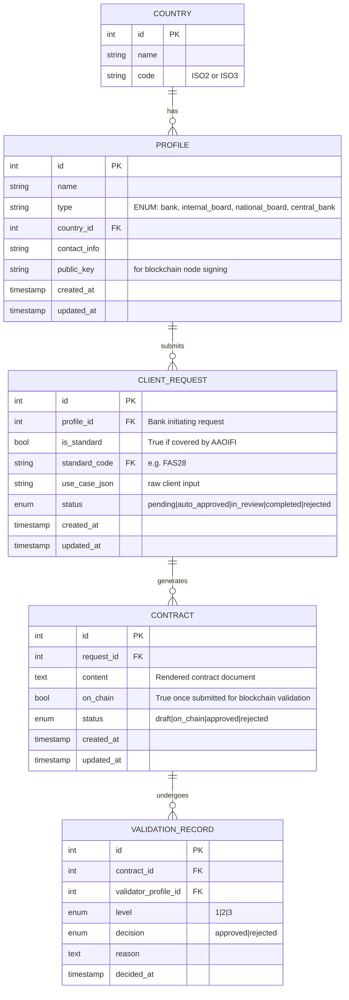

```mermaid
erDiagram
    COUNTRY ||--o{ PROFILE       : has
    PROFILE ||--o{ CLIENT_REQUEST : submits
    CLIENT_REQUEST ||--o{ CONTRACT  : generates
    CONTRACT ||--o{ VALIDATION_RECORD : undergoes
    PROFILE {
      int id PK
      string name
      string type       "ENUM: bank, internal_board, national_board, central_bank"
      int country_id FK
      string contact_info
      string public_key "for blockchain node signing"
      timestamp created_at
      timestamp updated_at
    }
    COUNTRY {
      int id PK
      string name
      string code       "ISO2 or ISO3"
    }
    CLIENT_REQUEST {
      int id PK
      int profile_id FK "Bank initiating request"
      bool is_standard "True if covered by AAOIFI"
      string standard_code FK "e.g. FAS28"
      string use_case_json "raw client input"
      enum status    "pending|auto_approved|in_review|completed|rejected"
      timestamp created_at
      timestamp updated_at
    }
    CONTRACT {
      int id PK
      int request_id FK
      text content   "Rendered contract document"
      bool on_chain  "True once submitted for blockchain validation"
      enum status   "draft|on_chain|approved|rejected"
      timestamp created_at
      timestamp updated_at
    }
    VALIDATION_RECORD {
      int id PK
      int contract_id FK
      int validator_profile_id FK
      enum level    "1|2|3"
      enum decision "approved|rejected"
      text reason
      timestamp decided_at
    }
```
