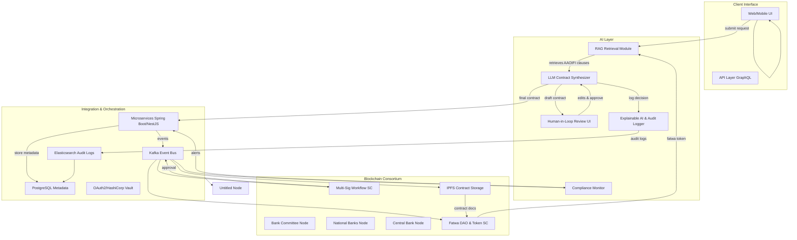

# Software Architecture

```mermaid
flowchart TB
 subgraph A["Client Interface"]
        C1["Web/Mobile UI"]
        C2["API Layer GraphQL"]
  end
 subgraph B["AI Layer"]
    direction TB
        B1["RAG Retrieval Module"]
        B2["LLM Contract Synthesizer"]
        B3["Human-in-Loop Review UI"]
        B4["Explainable AI & Audit Logger"]
        B5["Compliance Monitor"]
  end
 subgraph C["Blockchain Consortium"]
    direction LR
        C1A["Bank Committee Node"]
        C1B["National Banks Node"]
        C1C["Central Bank Node"]
        C2A["Multi-Sig Workflow SC"]
        C2B["Fatwa DAO & Token SC"]
        C3["IPFS Contract Storage"]
  end
 subgraph D["Integration & Orchestration"]
    direction TB
        D1["Kafka Event Bus"]
        D2["Microservices Spring Boot/NestJS"]
        D3["PostgreSQL Metadata"]
        D4["Elasticsearch Audit Logs"]
        D5["OAuth2/HashiCorp Vault"]
  end
    C1 -- submit request --> B1
    B1 -- retrieves AAOIFI clauses --> B2
    B2 -- draft contract --> B3
    B3 -- edits & approve --> B2
    B2 -- final contract --> D2
    D2 -- store metadata --> D3
    B2 -- log decision --> B4
    B4 -- audit logs --> D4
    D1 --> C2A & C2B & C3 & B5
    C2A -- approval --> D1
    C2B -- fatwa token --> B1
    C3 -- contract docs --> C2B
    D2 -- events --> D1
    B5 -- alerts --> D2
    C1 --> C1
    D4 --> D3
    D --> n1["Untitled Node"]

```
